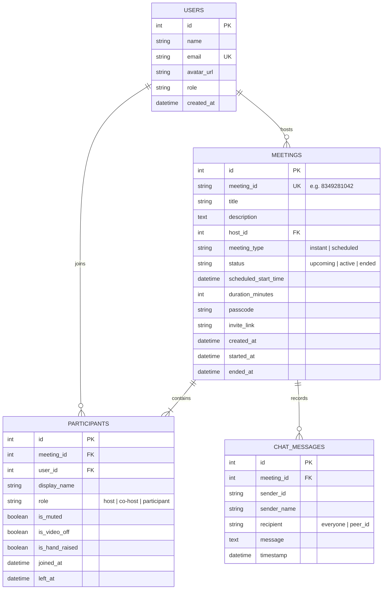

# Zoom Workplace Clone - Video Conferencing Web Application
> **SDE Fullstack Assignment Submission**  
> Built with **Next.js (React 19, TypeScript, Tailwind CSS)**, **Python (FastAPI, WebSockets, SQLAlchemy)**, and **SQLite**.

---

## 📸 Overview & Design Philosophy

This project is a full-featured video conferencing web application designed to faithfully replicate the design, user experience, and core workflows of **Zoom Web / Desktop Client**.

Key highlights:
- **Authentic Zoom Design System**: Signature Zoom Blue (`#0E71EB`), New Meeting Orange (`#E55625`), dark-mode in-meeting control dock (`#16161e`), green security shield popover, live digital clock and calendar widget.
- **Real-Time WebRTC Media Streaming**: Peer-to-peer audio and video transmission with STUN servers, microphone muting/unmuting, camera toggling, and native screen sharing (`getDisplayMedia`).
- **Real-Time WebSocket Signaling & Meeting Controls**: Bi-directional signaling for WebRTC negotiation (`offer`, `answer`, `ice-candidate`), synchronized participant presence, in-meeting chat, floating emoji reactions, and host moderation actions.
- **Relational SQLite Database**: Structured schema modeling users, meetings, participants, and chat logs with automatic seed data.

---

## 🛠️ Tech Stack

| Layer | Technology | Purpose |
|---|---|---|
| **Frontend** | **Next.js 16 (App Router)** | Modern React Single Page Application (SPA) architecture |
| **Styling** | **Tailwind CSS v4** | Pixel-accurate Zoom UI styling, dark meeting room mode, responsive layout |
| **Icons & FX** | **Lucide React & Canvas-Confetti** | Zoom-identical iconography and celebratory reaction animations |
| **Real-Time Media** | **WebRTC API** | Ultra-low-latency peer-to-peer audio, video, and screen sharing |
| **Backend** | **Python 3.11 + FastAPI** | High-performance asynchronous REST API and WebSockets server |
| **Signaling** | **FastAPI WebSockets** | Real-time WebRTC SDP exchange, host commands, and live chat broadcast |
| **ORM & Database**| **SQLAlchemy 2.0 + SQLite** | Structured relational database with automated seeding and foreign key integrity |

---

## 🗄️ Database Schema & Relational Design

The database is built on **SQLite** using **SQLAlchemy ORM**. The schema establishes clear relationships between users, meetings, participants, and in-meeting communications.



### Table Relationships & Integrity
1. **`users` -> `meetings`**: One-to-Many (`host_id`). A user can organize multiple meetings.
2. **`meetings` -> `participants`**: One-to-Many (`meeting_id`). Tracks every user or guest joining a meeting with join/leave timestamps and hardware state. Cascades on meeting deletion.
3. **`meetings` -> `chat_messages`**: One-to-Many (`meeting_id`). In-meeting chat history saved persistently with target recipient support (`everyone` or direct message).

---

## 🚀 Core Features Implemented

### 1. Landing Dashboard
- **Zoom Desktop/Web Aesthetic**: Clean white/light-gray layout, top navbar with profile avatar, status indicators (Available, Busy, Away), search bar, and settings button.
- **4 Action Tiles**:
  - **New Meeting** (Orange `#E55625`): Creates an instant meeting and immediately opens the room.
  - **Join** (Zoom Blue `#0E71EB`): Opens modal to join by Meeting ID or pasted link.
  - **Schedule** (Zoom Blue `#0E71EB`): Opens the scheduling modal with date, time, and duration picker.
  - **Share Screen**: Quick shortcut to join and initialize screen presentation.
- **Live Digital Clock Widget**: Displays real-time digital clock (HH:MM AM/PM), formatted date, and "Up Next" meeting highlight card.
- **Upcoming Meetings Section**: Shows scheduled meetings with title, formatted ID, duration, host badge, 1-click **Start Meeting**, and **Copy Link** button.
- **Recent Meetings Section**: Archive of completed meetings with duration and participant summary.

### 2. Instant Meeting Creation
- Click **"New Meeting"** on the dashboard.
- Generates a unique 10-digit Zoom meeting ID (e.g. `834 928 1042`).
- Auto-generates shareable invite link (`/meeting/[id]`) and random 6-character alphanumeric passcode.
- Stores record in SQLite with status `active` and registers the host.
- Immediately redirects user into the meeting room.

### 3. Join Meeting & Pre-join Lobby
- Join by entering 9–10 digit Meeting ID or full invite URL.
- Validates meeting existence against the backend SQLite database.
- **Pre-join Lobby**: Allows previewing camera video, testing microphone, choosing display name, and toggling initial audio/video state before entering the call.

### 4. Schedule Meetings
- Title / Topic and optional description.
- Date picker and start time picker.
- Duration selector (15, 30, 45, 60, 90, 120 minutes).
- Passcode protection and Waiting Room options.
- Persisted to SQLite database and instantly appears in the **Upcoming Meetings** list.

### 5. In-Meeting Video Conferencing Room (WebRTC + WebSockets)
- **Top Bar**:
  - **Green Shield (Security Popover)**: Meeting Topic, Meeting ID, Passcode, 1-click Copy Invite Link, and AES 256-bit encryption indicator.
  - **Live Indicators**: Recording badge (`REC`), Hand Raised badge (`✋`).
  - **View Controls**: Toggle between Gallery View and Speaker View.
- **Center Stage**:
  - Responsive Video Grid adapting from 1 to 9+ attendees.
  - Real local camera stream and remote peer WebRTC streams.
  - Fallback avatar with initial circle when camera is turned off.
  - Live microphone state badges (active green mic vs muted red mic).
  - Real screen sharing (`navigator.mediaDevices.getDisplayMedia`).
- **Bottom Dock Controls**:
  - Microphone mute/unmute.
  - Camera video on/off.
  - Security menu (Lock meeting, toggle participant permissions).
  - Participants drawer toggle (with attendee badge count).
  - Chat drawer toggle (with unread message count).
  - Screen share button (Zoom green `#00B050`).
  - Reactions bar (👏, 👍, ❤️, 😂, 😮, 🎉, ✋ Hand Raise) with floating animations and confetti.
  - **Add Simulated Bot Attendee** button (convenient testing helper allowing solo evaluators to test multi-participant views, muting, and removal).
  - Red **End / Leave** meeting button.

### 6. Host Controls (Bonus Feature)
- **Mute All**: Host can mute all attendees with one click.
- **Remove Participant**: Host can kick any attendee out of the room; the participant's client is immediately disconnected and returned to the dashboard.
- **End Meeting for All**: Host can end the entire session for everyone.

---

## 🏃 Local Setup & Running Guide

### Prerequisites
- **Node.js** (v18+ or v22+)
- **npm** (v8+ or later)
- **Python** (v3.10+ or v3.11+)

---

### Method A: One-Click Startup (Windows)

Simply double-click:
```bat
start_servers.bat
```
*(or run `.\start_servers.ps1` in PowerShell)*

This automatically starts both the FastAPI backend on port `8000` and the Next.js frontend on port `3000` in separate windows.

---

### Method B: Manual Startup

#### Step 1: Start Backend (FastAPI + SQLite)
```powershell
cd backend
..\venv\Scripts\python.exe -m uvicorn app.main:app --host 127.0.0.1 --port 8000 --reload
```
*Backend will be running at:* `http://localhost:8000`  
*Interactive Swagger API Docs:* `http://localhost:8000/docs`

> *Note: On first startup, the database `zoom_clone.db` is automatically created and seeded with realistic sample upcoming and past meetings, users, and participants.*

#### Step 2: Start Frontend (Next.js)
In a new terminal window:
```powershell
cd frontend
npm run dev
```
*Frontend application will be live at:* `http://localhost:3000`

---

## 🌐 Cloud Deployment Guide

### Deploying Frontend on Vercel
1. Push repository to GitHub.
2. Sign in to [Vercel](https://vercel.com) and click **"Add New Project"**.
3. Select the repository and set Root Directory to `frontend`.
4. Add Environment Variables:
   - `NEXT_PUBLIC_API_URL`: Your deployed backend URL (e.g. `https://zoom-backend.onrender.com`)
   - `NEXT_PUBLIC_WS_URL`: Your deployed WebSocket URL (e.g. `wss://zoom-backend.onrender.com`)
5. Click **Deploy**.

### Deploying Backend on Render / Railway
1. Set Root Directory to `backend`.
2. Build Command: `pip install -r requirements.txt`
3. Start Command: `uvicorn app.main:app --host 0.0.0.0 --port $PORT`
4. Environment Variables:
   - `DATABASE_URL`: `sqlite:///./zoom_clone.db` (or PostgreSQL if preferred)

---

## 💡 Assumptions & Design Decisions

1. **Default Authenticated Host**: As per the assignment prompt instructions (*"Assume a default user is logged in. Focus on functionality rather than authentication"*), the application initializes with default host profile `Alex Johnson (Host)`. A status switcher and profile menu are provided in the navbar.
2. **WebRTC STUN Configuration**: Uses standard Google public STUN servers (`stun:stun.l.google.com:19302`) for peer-to-peer NAT traversal without requiring paid TURN infrastructure for local / cross-network evaluation.
3. **Database Pre-seeding**: The SQLite database automatically populates realistic upcoming sprint syncs, design reviews, and past archived meetings on initial launch so the application feels alive immediately upon opening.
4. **Direct URL Join**: Navigating directly to `/meeting/[id]` (e.g. in an incognito window or separate browser) allows another user to join the same call seamlessly.
5. **Evaluator Testing Aid**: An "+ Bot Attendee" button is built directly into the bottom control bar to allow evaluators reviewing on a single laptop to test host moderation (mute all, remove participant) without needing two separate computers.

---

## 📂 Project Structure

```
zoom-clone/
├── backend/
│   ├── app/
│   │   ├── __init__.py
│   │   ├── config.py             # Settings, CORS, and defaults
│   │   ├── database.py           # SQLAlchemy SQLite engine & session
│   │   ├── models.py             # Relational DB models (User, Meeting, Participant, Chat)
│   │   ├── schemas.py            # Pydantic v2 validation models
│   │   ├── crud.py               # Database queries & business logic
│   │   ├── seed.py               # Sample data generator
│   │   ├── websocket_manager.py  # WebRTC signaling & real-time broadcast manager
│   │   ├── main.py               # FastAPI app, REST routes, WebSockets
│   │   └── routes/
│   │       ├── meetings.py       # Meeting CRUD & host moderation endpoints
│   │       └── users.py          # User management endpoints
│   ├── requirements.txt
│   └── run.py
├── frontend/
│   ├── src/
│   │   ├── app/
│   │   │   ├── layout.tsx        # Zoom Workplace metadata & root layout
│   │   │   ├── page.tsx          # Single-Page App view coordinator
│   │   │   └── meeting/[id]/
│   │   │       └── page.tsx      # Direct link meeting room route
│   │   ├── components/
│   │   │   ├── Navbar.tsx        # Zoom header & profile status menu
│   │   │   ├── Dashboard.tsx     # 4 Zoom tiles, live clock, meeting lists
│   │   │   ├── JoinMeetingModal.tsx
│   │   │   ├── ScheduleMeetingModal.tsx
│   │   │   ├── SettingsModal.tsx # Video/Audio device tester
│   │   │   ├── MeetingLobby.tsx  # Pre-join preview screen
│   │   │   └── MeetingRoom.tsx   # Video grid, toolbar, sidebars & host controls
│   │   ├── hooks/
│   │   │   └── useWebRTC.ts      # Custom hook managing WebRTC & WebSocket signaling
│   │   ├── services/
│   │   │   └── api.ts            # Client API client for backend
│   │   └── types/
│   │       └── meeting.ts        # TypeScript data contracts
│   ├── .env.local
│   ├── package.json
│   └── tailwind.config.ts
├── start_servers.bat             # 1-Click Windows launch script
├── start_servers.ps1             # PowerShell launch script
└── README.md
```

---

*Authored for the Zoom Clone SDE Fullstack Assignment.*
